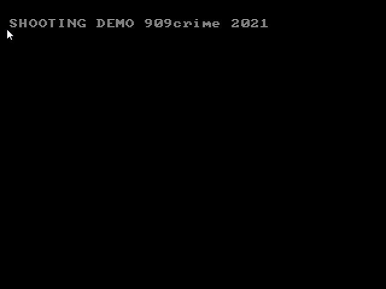

# segaShmupDemo
SHMUP game proof of concept for Basiegaxorz. 

I was trying to port Kiki KaiKai to the Sega Genesis and came up with this to test out some concepts.

This code includes:
  - starfield generation
  - asset management (sprite count remains under the system limit)
  - rudimentary SFX engine using the PSG channels (basically switches channels if one is being used)
  - player movement and controls
  - collision detection (non functional, direct port of the java program I wrote)
  
  
 
 Screenshot:
 
 

 Notes:
  - uses the ASCII tileset from BEX for graphics
